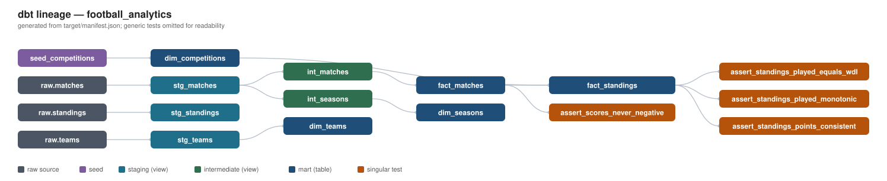
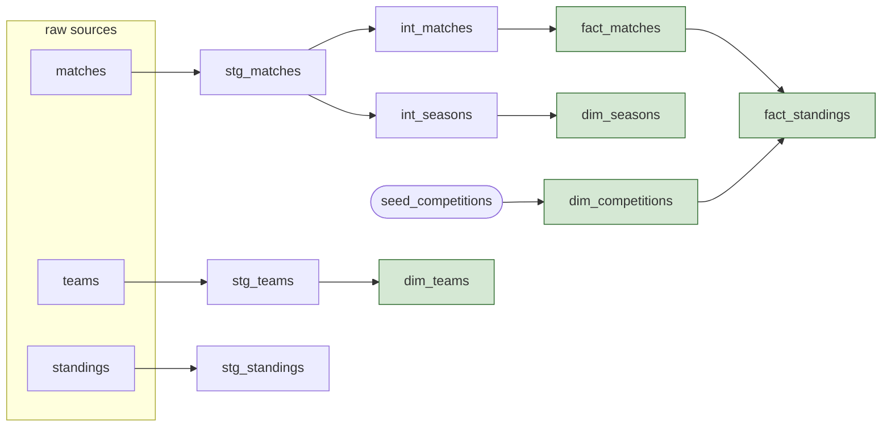

[](https://github.com/andre3oo0/football-analytics/actions/workflows/pipeline.yml)
# Football data pipeline

An end-to-end analytics engineering project. It pulls football data from a
public API, lands it raw in a local warehouse, and models it into a tested,
documented star schema with dbt, all wired up to run on a schedule in GitHub
Actions.

The interesting part here is the transformation, testing, documentation and
orchestration, not a dashboard at the end. The dimensional model, the dbt tests,
and the question "does this fail loudly when the data is wrong?" are the point.

## Documentation

Detailed reference docs live in [docs/](docs/README.md): architecture, running
the project, ingestion internals, the data model and dictionary, testing,
orchestration, and the design decisions. New here?
[CONTRIBUTING.md](CONTRIBUTING.md) is a short onboarding guide.

## Stack

- Python 3.11+ for ingestion only
- DuckDB as the warehouse (a single local `.duckdb` file)
- dbt-duckdb for all transformation, testing and docs
- GitHub Actions for scheduling

## How it fits together

```
football-data.org API (REST v4, free tier: 10 req/min)
        |
        |  Python ingestion: rate-limited (~8/min) + backoff, cache to disk first
        v
  data/raw/*.json           every response cached before loading
        |
        v
  DuckDB (raw schema)        idempotent upsert by natural key, no duplicates
        |
        |  dbt
        v
  staging/       1:1 with raw, rename + cast + unpack only (views)
  intermediate/  joins, dedup, business logic (views)
  marts/         star schema, dims + facts (tables)
        |
        v
  dbt tests (generic + singular)  +  dbt docs (lineage)
        |
        v
  GitHub Actions: cron + manual, ingest -> dbt build, red on any test failure
```

| Layer         | Tech           | What it does                                  |
|---------------|----------------|-----------------------------------------------|
| Ingestion     | Python 3.11+   | Fetch, cache raw JSON, load the `raw` schema  |
| Warehouse     | DuckDB         | One local `.duckdb` file                      |
| Staging       | dbt (views)    | Rename / cast / unpack only, stays thin       |
| Intermediate  | dbt (views)    | Joins, dedup, business logic                  |
| Marts         | dbt (tables)   | Star schema (dims + facts)                    |
| Orchestration | GitHub Actions | Scheduled + manual runs                       |

## Data source

[football-data.org](https://www.football-data.org/) REST API v4, free tier.

- Auth is an API key sent as the `X-Auth-Token` header, read from the
  `FOOTBALL_DATA_API_KEY` environment variable. It is never hardcoded or
  committed.
- The free tier allows 10 requests a minute, so the client throttles to about 8
  a minute and backs off on HTTP 429. Getting IP-banned isn't really possible.
- Every response is written to `data/raw/` as JSON before it's loaded, so
  re-running locally doesn't hit the API again.

Competitions:

| Code | Competition         | Type       |
|------|---------------------|------------|
| PL   | Premier League      | LEAGUE     |
| PD   | La Liga             | LEAGUE     |
| BL1  | Bundesliga          | LEAGUE     |
| SA   | Serie A             | LEAGUE     |
| FL1  | Ligue 1             | LEAGUE     |

Endpoints per competition: `/teams`, `/matches`, `/standings`.

Seasons: the five leagues are pulled for the live 2026/27 season, plus two
completed seasons (2024/25 via `--season 2024` and 2025/26 via `--season 2025`).
Ingestion is season-aware and caches each season separately.

### The live season

The 2026/27 season is under way, so the pipeline is now doing what it was built
for: each scheduled run picks up newly finished matches and `fact_standings`
extends by a matchday. As of the last run the leagues were 1–3 matchdays in
(La Liga 3, Premier League / Serie A / Ligue 1 2, Bundesliga 1), contributing
194 standings rows on top of the completed seasons.

The two completed seasons were backfilled because the project was built during
the off-season, when the live season had no results at all and a table derived
from finished matches was legitimately empty. They still earn their place: each
gives a full 38- (or 34-) matchday progression to test and demonstrate against,
which a season two matchdays old can't.

## Dimensional model

- `dim_competitions`: one row per competition, with a `competition_type`
  classification (all leagues at the moment).
- `dim_teams`: one row per team, unioned across the seasons ingested.
- `dim_seasons`: one row per competition-season.
- `fact_matches`: one row per match across every competition and season. Scores
  are nullable until a match is played.
- `fact_standings`: one row per team per matchday, derived by cumulating
  finished match results (not the standings endpoint), built incrementally,
  leagues only.

Current row counts: `dim_competitions` 5, `dim_teams` 121, `dim_seasons` 15,
`fact_matches` 5,256, `fact_standings` ~7,200 (7,008 from the two completed
seasons plus the live 2026/27 season as its matchdays are played).

## Design decisions

The whole reason to write these down is so I can defend each one.

**Idempotent ingestion means upsert by natural key, enforced by the table.**
Each raw table declares its natural key as a PRIMARY KEY (`team_id`, `match_id`,
and `(competition_code, season_id, team_id, matchday, standing_type)` for
standings). Loads run `INSERT ... ON CONFLICT DO UPDATE`, so re-running never
duplicates a row and a re-fetched match overwrites its old row. There's exactly
one current row per key; I don't keep raw history.

**Raw stores the key plus the untouched JSON payload, not flattened columns.**
That keeps ingestion generic and hard to break when the API adds a field, and it
pushes all the field-level work into dbt where it belongs. Staging then unpacks
the JSON, one thin view per source, no joins or logic.

**One `fact_matches` for every competition.** The grain is the same (a match is
a match) and most questions cross competitions. Splitting into per-competition
fact tables would just force UNIONs. The competition FK carries the distinction
instead.

**`fact_standings` is derived from match results, not the standings endpoint.**
The endpoint only returns one current table, and in the off-season it returns
last season's final numbers stamped with the new season at matchday 1, which is
self-contradictory. Computing each matchday's table from finished results is
consistent and gives a real week-by-week progression. As a sanity check, the
derived 2024/25 Premier League table matches reality (Liverpool champions on 84
points). The raw standings still land in `raw.standings`, but nothing depends on
them.

**A definitive result counts, not just FINISHED.** An AWARDED match (a forfeit
with an official scoreline) has a real result and has to count, otherwise a
league table comes out wrong. So the rule is `has_result = status in
('FINISHED', 'AWARDED')`.

**`fact_standings` uses delete+insert on a surrogate key.** The key is
`standing_key` = `competition|season|team|matchday`. delete+insert deletes the
target rows whose key is in the incoming batch and reinserts, so a re-fetched
matchday is replaced in place rather than duplicated, and a new matchday is
appended. When new results land for a season the whole season is re-derived,
because a corrected early result changes every later matchday's totals. append
would duplicate; merge would add per-column update SQL for no real benefit here.

**`dim_competitions` comes from a seed.** `competition_type` is my own
classification rather than an API field, and the competition list is small static
reference data, which is what seeds are for.

**Schema names are kept clean via a `generate_schema_name` macro.** dbt's default
would prefix everything (`main_staging`, ...). That default exists to stop
developers clobbering each other in a shared warehouse, which isn't a concern for
a single local file, so I override it for a more readable lineage graph.

**Everything runs single-writer.** DuckDB allows one writer at a time. Ingest and
each dbt command run as separate sequential processes that open and close the
file, and the CI job uses a concurrency group so two scheduled runs can't
overlap.

## Tests

- `unique` and `not_null` on every primary key.
- A `relationships` test on every foreign key (each fact FK back to its dim).
- `accepted_values` on the enum-like columns. `stage` lists only the value it
  ever takes (`REGULAR_SEASON`) and fails on anything else; `status` is a
  volatile, sometimes-dirty source field, so it warns rather than fails.
- Four singular tests: scores are never negative; `played = won + drawn + lost`;
  `points = won*3 + drawn`; and cumulative games played never decreases as the
  matchday increases.

`dbt build` runs models and tests together and comes back with `ERROR=0` (the
`status` check reports a warning, by design).

## Local setup and run

```bash
# 1. Virtual environment (Python 3.11+)
python -m venv .venv
source .venv/bin/activate          # Windows: .venv\Scripts\activate

# 2. Dependencies
pip install -r requirements.txt

# 3. Credentials
cp .env.example .env               # then paste your football-data.org key

# 4. Ingest
python -m ingestion.run                         # cache-first, no API calls if cached
# python -m ingestion.run --refresh             # re-fetch the live season
# completed seasons for the derived standings:
# python -m ingestion.run --refresh --season 2024 --competitions PL PD BL1 SA FL1 --endpoints teams matches
# python -m ingestion.run --refresh --season 2025 --competitions PL PD BL1 SA FL1 --endpoints teams matches

# 5. Transform, test, docs (run from dbt/)
cd dbt
dbt build --profiles-dir .
dbt source freshness --profiles-dir .
dbt docs generate --profiles-dir . && dbt docs serve --profiles-dir .
```

## Orchestration

[`.github/workflows/pipeline.yml`](.github/workflows/pipeline.yml) runs on a cron
schedule (06:00 UTC) and on manual dispatch. The steps are sequential (install,
ingest the live season, `dbt build`, generate docs), each its own process so the
DuckDB file is never opened by two writers at once. `dbt build` exits non-zero if
any test fails, so a data problem turns the job red.

The API key comes from a GitHub repository secret, `FOOTBALL_DATA_API_KEY`,
injected as an environment variable. Only `.env.example` is in git.

On TLS: locally I'm behind an SSL-inspecting proxy, so the client uses
`truststore` to verify against the OS trust store (which has the corporate root)
instead of certifi's bundle. On a GitHub runner there's no corporate root, so the
OS store is just the normal public CAs and this becomes ordinary public-CA
verification. Verification stays on either way.

CI only pulls the live current season. I don't re-pull the frozen 2024/25
backfill on a schedule, because it can't change.

To run it on GitHub:

```bash
git remote add origin https://github.com/<you>/football-analytics.git
git push -u origin main
# Settings > Secrets and variables > Actions > New repository secret
#   FOOTBALL_DATA_API_KEY = <your key>
# Then: Actions > football-data-pipeline > Run workflow
```

## Lineage

Sources and seed through to the marts, with the singular tests hanging off the
facts. Generated from dbt's `manifest.json`, so it reflects the real DAG (generic
tests are omitted for readability):



Same thing as a diagram that renders inline on GitHub:



## Repo layout

```
ingestion/          Python: fetch -> cache raw JSON -> load DuckDB raw schema
dbt/
  models/staging/       1:1 with raw, views
  models/intermediate/  joins, dedup, business logic
  models/marts/         star schema, tables
  tests/                custom singular tests
  seeds/                competition reference data
.github/workflows/  scheduled pipeline
data/               DuckDB file + cached raw JSON (git-ignored)
```
