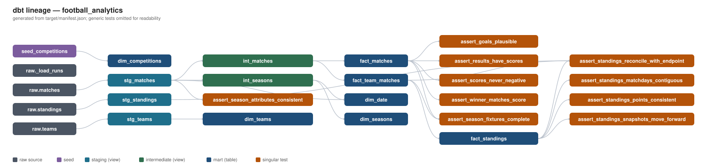
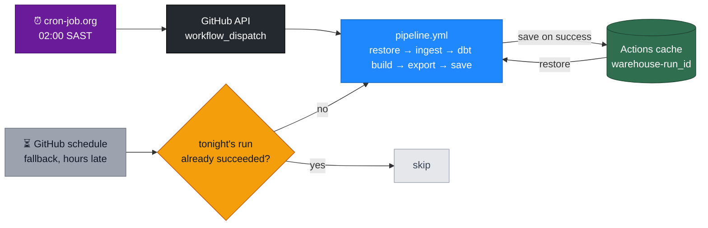
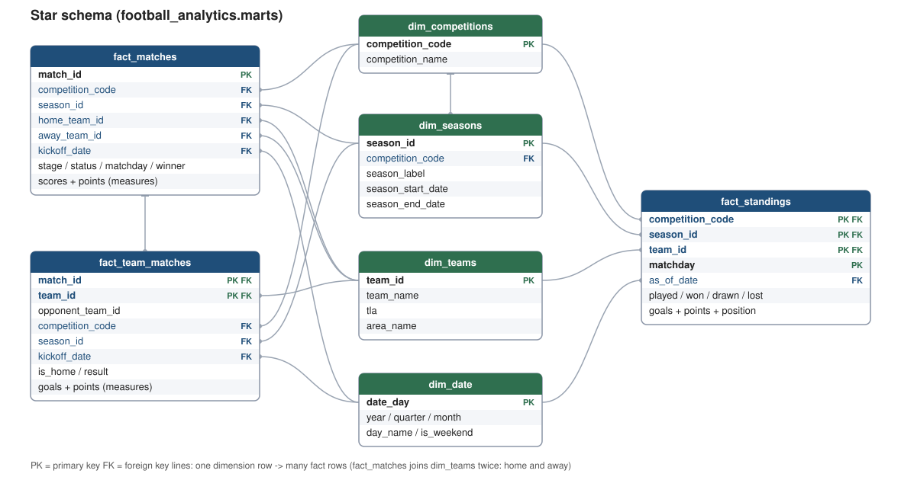

<div align="center">

# ⚽ Football data pipeline

**Five European leagues, three seasons, rebuilt every night into a tested star schema.**

[](https://github.com/andre3oo0/football-analytics/actions/workflows/ci.yml)
[](https://github.com/andre3oo0/football-analytics/actions/workflows/pipeline.yml)


[](https://andre3oo0.github.io/football-analytics/)

</div>

## About

This project pulls the Premier League, La Liga, Bundesliga, Serie A and Ligue 1
from the [football-data.org](https://www.football-data.org) API and models them
into a star schema in DuckDB with dbt. It holds the live 2026/27 season and the
two before it, 2024/25 and 2025/26.

Every night at 02:00 South African time a GitHub Actions run restores
yesterday's warehouse, loads that day's results, rebuilds the models, runs over
a hundred tests and exports the marts to Parquet for a BI tool.

The most involved model is `fact_standings`: the league table after every
matchday, derived from match results and checked team by team against the
league tables the API publishes.

| | |
|---|---|
| 🏟️ **Leagues** | PL, PD, BL1, SA, FL1, listed once in [`seed_competitions.csv`](dbt/seeds/seed_competitions.csv) |
| 📅 **Seasons** | 2024/25 and 2025/26 (complete), 2026/27 (live) |
| 🌙 **Runs** | 02:00 SAST nightly, started by cron-job.org ([why](#-the-nightly-run)) |
| 🦆 **Warehouse** | one DuckDB file, carried between runs in the GitHub Actions cache |
| 🧱 **Marts** | 4 dimensions and 3 facts, each with an enforced contract |
| ✅ **Tests** | pytest, dbt unit tests, data tests and a reconciliation against the API's tables |
| 📦 **Output** | Parquet files per mart, uploaded as a build artifact every night |
| 📖 **dbt docs** | rebuilt nightly and published at [andre3oo0.github.io/football-analytics](https://andre3oo0.github.io/football-analytics/) |

## 🗺️ Architecture


```mermaid
flowchart LR
    API[("football-data.org<br/>REST v4")]:::source
    ING["ingestion/ (Python)<br/>throttle · retry · validate · cache"]:::python
    RAW[("DuckDB raw<br/>key + JSON payload")]:::raw
    STG["staging<br/>views"]:::staging
    INT["intermediate<br/>views"]:::intermediate
    MARTS[("marts<br/>7 tables, contracts")]:::marts
    PQ["exports/*.parquet"]:::output
    BI["BI tool"]:::output

    API --> ING --> RAW --> STG --> INT --> MARTS --> PQ --> BI

    classDef source fill:#4b5563,stroke:#1f2937,color:#ffffff
    classDef python fill:#3776AB,stroke:#1e4f7a,color:#ffffff
    classDef raw fill:#FFF000,stroke:#b3a800,color:#000000
    classDef staging fill:#1f6f8b,stroke:#134457,color:#ffffff
    classDef intermediate fill:#2f6f4f,stroke:#1c4430,color:#ffffff
    classDef marts fill:#FF694B,stroke:#b34a35,color:#ffffff
    classDef output fill:#7c5c9e,stroke:#523d69,color:#ffffff
```

Python extracts and loads; dbt does every transformation. Each API response is
validated before it is cached, a run loads everything in one transaction, and
every run is logged in `raw._load_runs`.

The dbt lineage, generated from the manifest (CI fails if the committed SVG is
out of date):



## 🌙 The nightly run


```mermaid
flowchart LR
    CRON["⏰ cron-job.org<br/>02:00 SAST"]:::trigger
    DISPATCH["GitHub API<br/>workflow_dispatch"]:::gh
    RUN["pipeline.yml<br/>restore → ingest → dbt build → export → save"]:::run
    CACHE[("Actions cache<br/>warehouse-run_id")]:::cache
    SCHED["⏳ GitHub schedule<br/>fallback, hours late"]:::fallback
    DECIDE{"tonight's run<br/>already succeeded?"}:::decide

    CRON --> DISPATCH --> RUN
    CACHE -- restore --> RUN
    RUN -- save on success --> CACHE
    SCHED --> DECIDE
    DECIDE -- yes --> SKIP["skip"]:::skip
    DECIDE -- no --> RUN

    classDef trigger fill:#6A1B9A,stroke:#4a1270,color:#ffffff
    classDef gh fill:#24292f,stroke:#000000,color:#ffffff
    classDef run fill:#2088FF,stroke:#155fb3,color:#ffffff
    classDef cache fill:#2f6f4f,stroke:#1c4430,color:#ffffff
    classDef fallback fill:#9ca3af,stroke:#6b7280,color:#111827
    classDef decide fill:#f59e0b,stroke:#b45309,color:#111827
    classDef skip fill:#e5e7eb,stroke:#9ca3af,color:#374151
```

**Why 02:00 SAST.** The last European evening kickoffs are around 21:00 CET and
finish about two hours later. By 02:00 SAST (00:00 UTC) no match is in play, so
the results are final and the standings endpoint agrees with them.

**Why an external trigger.** GitHub's own `schedule` trigger is best effort. On
this repository scheduled runs started four to seven hours late, and midnight
UTC is the busiest slot of the day. A run started through the
`workflow_dispatch` API begins within seconds, so a free
[cron-job.org](https://cron-job.org) job calls that API at 02:00 SAST with a
fine-grained token that can only start and read workflow runs on this
repository.

**Why keep GitHub's schedule too.** It is the safety net. If the cron-job.org
call fails or the token expires, the scheduled run still arrives, late, and does
the work. When the 02:00 run has already succeeded, a small `decide` job skips
it, so the data isn't pulled twice.

**Exact versions.** CI and the pipeline install `requirements.lock` for the
Python version in `.python-version`, so a new dependency release can't change
a nightly build without a commit.

**Where the state lives.** Each successful run saves the warehouse and the raw
JSON to the Actions cache, and the next run restores it, so completed seasons
aren't downloaded again. A failed run saves nothing, which leaves the last good
warehouse in place.

> [!TIP]
> Setting it up on a fork, including the token and the cron-job.org request,
> is step by step in [docs/orchestration.md](docs/orchestration.md#setting-up-the-external-trigger).

## 🧱 The model



| Table | Grain |
|-------|-------|
| `dim_competitions` | competition |
| `dim_seasons` | competition-season |
| `dim_teams` | team (Type 1) |
| `dim_date` | calendar day covering every season and kickoff |
| `fact_matches` | match |
| `fact_team_matches` | team per match (two rows per match) |
| `fact_standings` | competition, season, team and matchday |

`fact_standings` takes each matchday's snapshot as of a date, so a postponed
game played weeks later doesn't rewrite past tables; the team shows a game in
hand until then. It is built incrementally, one season at a time. The mechanism
is in [docs/data-model.md](docs/data-model.md) and the reasoning in
[docs/design-decisions.md](docs/design-decisions.md).

## 🚀 Quickstart

No API key needed. One real season (Bundesliga 2024/25) is committed in
`tests/fixtures/raw`:

```bash
python -m venv .venv
source .venv/bin/activate              # Windows: .venv\Scripts\activate
pip install -r requirements-dev.lock

python -m ingestion.run --cache-dir tests/fixtures/raw --season 2024 --competitions BL1
cd dbt && dbt build --profiles-dir .
```

With a free football-data.org API key in `.env` (copy `.env.example`),
`python -m ingestion.run` pulls the live season for all five leagues, and
`--season 2024` / `--season 2025` add the completed ones. Every command is in
[docs/running-the-project.md](docs/running-the-project.md).

## ✅ What is tested

| Layer | What it covers |
|-------|----------------|
| 🐍 **pytest** | API client retries, 404s and invalid bodies; response validation; the loader's idempotency, change-only upserts, deletes and rollback; a full ingestion run over the fixtures |
| 🧪 **dbt unit tests** | standings on hand-built data: a postponed match, a round postponed whole, a game brought forward, shared positions, a team with no game in a window; AWARDED and live matches; status normalisation |
| 🔑 **generic tests** | keys, every foreign key, enum values, the grain of each fact |
| 📐 **singular tests** | a complete double round-robin, `winner` agreeing with the score, scores present for every result, snapshots moving forward with no gaps in the matchdays, plausible goal totals |
| 📜 **contracts** | column names and types on all seven marts |
| ⚖️ **reconciliation** | the derived table against the API's standings, team by team, for every season |
| 🚨 **anomaly guards** | ingestion refuses a response that would delete more than 5 stored matches; each nightly run warns if the restored warehouse is more than a day old |

CI runs all of it on every pull request, with no API key. Details in
[docs/testing-and-quality.md](docs/testing-and-quality.md).

> [!NOTE]
> **AWARDED matches.** football-data.org's standings table leaves out AWARDED
> matches, while the leagues count them. The data holds three: Union Berlin 0-2
> Bochum (Bundesliga 2024/25), Montpellier 0-2 Saint-Étienne (Ligue 1 2024/25)
> and Nantes 0-0 Toulouse (Ligue 1 2025/26). `fact_standings` counts them, as
> the leagues do, and the reconciliation test subtracts their contribution
> before comparing with the endpoint.

## ⚠️ Known limitations

- The date each matchday snapshot is taken at comes from a heuristic: the last
  game within 3 days of the round's median kickoff date.
- Teams level on points, goal difference and goals scored share a position.
  Head-to-head tie-breaks are not modelled.
- Points deductions are not modelled. The reconciliation test would fail if one
  happened.
- No history: `dim_teams` is Type 1 and raw keeps only the current payload.
- The warehouse lives in the GitHub Actions cache, which GitHub evicts after
  7 days without use. The next run then re-pulls the completed seasons.
- The 02:00 start depends on cron-job.org and a GitHub token that expires. If
  either fails, GitHub's own schedule runs the pipeline, hours late.
- Each run re-pulls whole seasons; there is no date-windowed extraction.
- DuckDB allows one writer, so steps run one after another.
- `kickoff_date` is the UTC date of kickoff.
- The Power BI model is not in the repo. That work is paused.

The fuller list, with consequences, is in
[docs/design-decisions.md](docs/design-decisions.md#known-limitations).

## 📚 Documentation

| Doc | What's in it |
|-----|--------------|
| [Architecture](docs/architecture.md) | layers, data flow, the warehouse, where state lives |
| [Running the project](docs/running-the-project.md) | setup, commands, rebuilds, troubleshooting |
| [Ingestion](docs/ingestion.md) | the Python layer, the raw schema, the run log, CLI reference |
| [Data model](docs/data-model.md) | the star schema and how `fact_standings` is built |
| [Data dictionary](docs/data-dictionary.md) | every table and column, with types |
| [Testing and quality](docs/testing-and-quality.md) | each test layer and what it catches |
| [Orchestration](docs/orchestration.md) | CI, the nightly pipeline, the external trigger |
| [Design decisions](docs/design-decisions.md) | the decisions, their reasons, the known limitations |
| [Exports](docs/exports.md) | the Parquet export and a Power BI model over it |

[CONTRIBUTING.md](CONTRIBUTING.md) covers making a change.

## 🗂️ Repo layout

```
ingestion/            fetch, validate, cache, load the raw schema
dbt/
  models/staging/       thin views over raw
  models/intermediate/  season dedup, match-level derivations
  models/marts/         the star schema
  models/_unit_tests.yml
  tests/                singular tests and one generic test
  seeds/                the competitions in scope
tests/                pytest suite; fixtures/raw holds one real season
export_marts.py       marts -> Parquet
docs/                 reference docs and generated diagrams
.github/workflows/    ci.yml (pull requests) and pipeline.yml (nightly)
data/                 DuckDB file and cached JSON (git-ignored)
```
