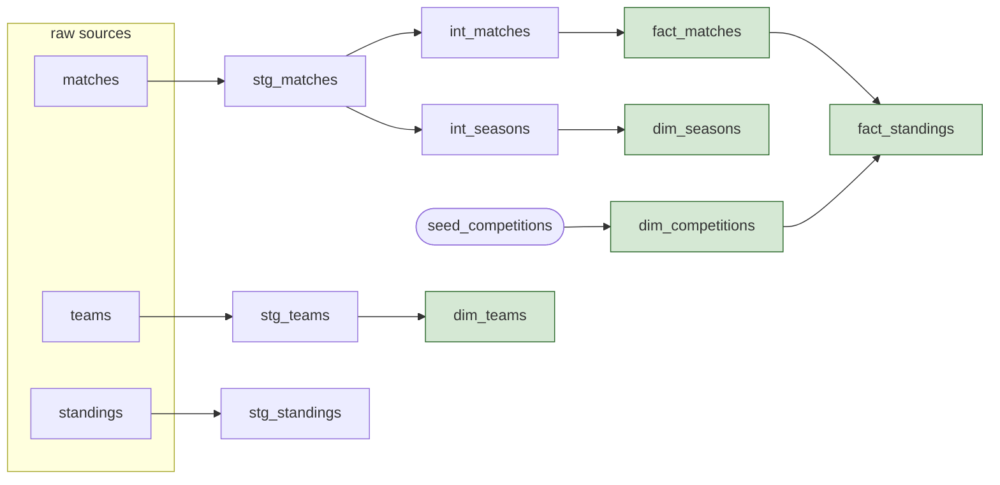

# Architecture

## Overview

The project is a small ELT pipeline with a clear separation between extraction
and transformation:

- Extract and load is done in Python. It fetches from the API, caches the raw
  JSON, and lands it in DuckDB with as little interpretation as possible.
- Transform is done entirely in dbt. All the renaming, casting, business logic
  and modelling happens here, in version-controlled SQL with tests and docs.

That split is deliberate. The Python side stays generic and hard to break when
the API changes shape; everything that needs judgement lives in dbt where it is
tested and documented.

## Data flow

```
football-data.org API (REST v4, free tier: 10 req/min)
        |
        |  Python ingestion
        |    - throttle to ~8 req/min, exponential backoff on 429
        |    - cache every response to data/raw/*.json BEFORE loading
        v
  DuckDB: raw schema
        |    - upsert by natural key (table PRIMARY KEY), idempotent
        |
        |  dbt (dbt-duckdb)
        v
  staging schema      thin, 1:1 with raw, rename/cast/unpack only (views)
        |
        v
  intermediate schema joins, dedup, business logic (views)
        |
        v
  marts schema        star schema, dims + facts (tables)
        |
        +--> dbt tests (generic + singular) and dbt docs (lineage)
        +--> export_marts.py -> exports/*.parquet (read-only)
        |
  GitHub Actions runs ingest -> dbt build on a schedule, red on any test failure
```

## Layers

| Layer        | Schema         | Materialization | Responsibility                              |
|--------------|----------------|-----------------|---------------------------------------------|
| Raw          | `raw`          | tables (Python) | Landed API payloads keyed by natural key    |
| Staging      | `staging`      | views           | Rename, cast, unpack JSON. No logic.        |
| Intermediate | `intermediate` | views           | Joins, dedup, derived measures              |
| Marts        | `marts`        | tables          | Star schema (dimensions + facts)            |

Keeping the layers distinct is a rule, not a suggestion. Staging never joins or
filters; if a transformation needs more than rename/cast/unpack, it belongs in
intermediate or marts.

## The warehouse

One DuckDB file: `data/football.duckdb`. DuckDB names the catalog after the file
stem, so the catalog is `football` and tables are addressed as
`football.<schema>.<table>` (or just `<schema>.<table>` when connected). The file
is a build artifact and is git-ignored; it can always be rebuilt from the cached
raw JSON plus dbt.

### Single-writer discipline

DuckDB allows only one writer on the file at a time. Every step in the pipeline
(ingest, each dbt command, the export, ad-hoc queries) runs as its own process
that opens and closes the file. This matters in a few places:

- Steps are always run sequentially, never two writers at once. The CI workflow
  uses a concurrency group so two scheduled runs cannot overlap.
- If another program holds the file open for writing (for example DBeaver), a
  pipeline step will block until it is released. A run that looks "hung" is
  usually this.
- The export script and any read-only query open the file with `read_only=True`,
  so they can never lock out or mutate the warehouse.

## Lineage



`stg_standings` is intentionally a leaf: `fact_standings` is derived from match
results, so nothing consumes the standings endpoint downstream. It is kept as a
faithful typed copy of that source and for freshness monitoring. See
[design-decisions.md](design-decisions.md).

A rendered version of the same lineage, generated from dbt's `manifest.json`, is
at [docs/lineage_dag.svg](lineage_dag.svg). For the interactive graph, run
`dbt docs generate && dbt docs serve` from `dbt/`.

## Technology

- Python 3.11+ for ingestion (`requests`, `python-dotenv`, `duckdb`, `truststore`).
- DuckDB as the warehouse engine.
- dbt-duckdb for transformation, testing and docs.
- GitHub Actions for scheduling.

See [running-the-project.md](running-the-project.md) for exact versions and setup.
