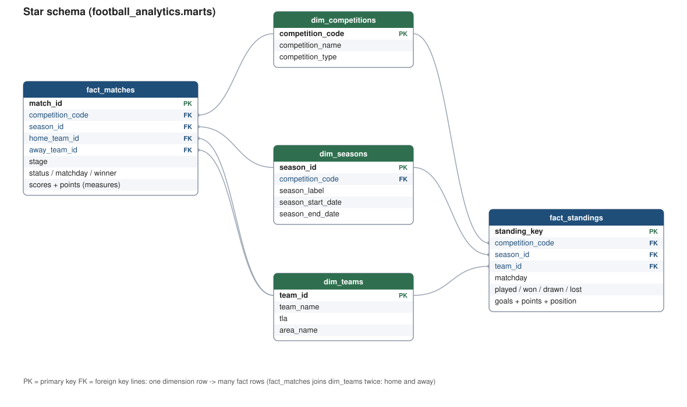
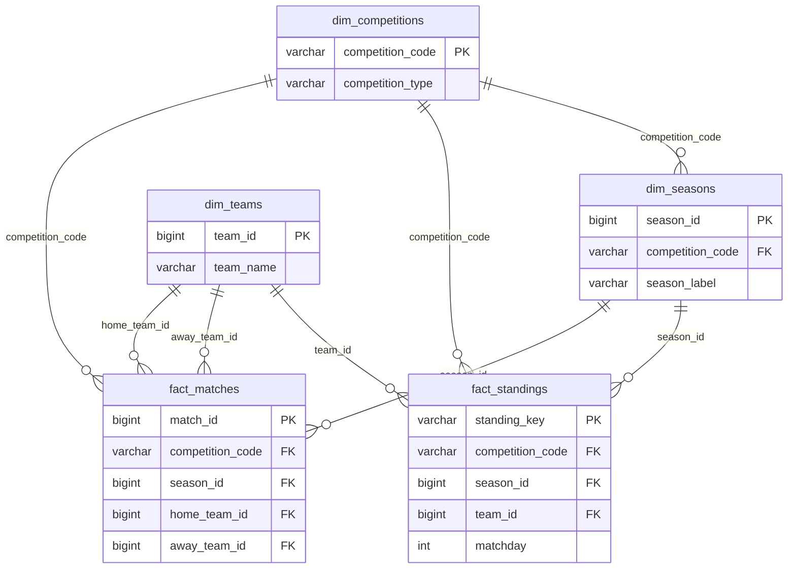

# Data model

A Kimball-style star schema: two fact tables sharing conformed dimensions. For
column-level detail and types see [data-dictionary.md](data-dictionary.md).

## Entity relationships

The same thing as a mermaid diagram (renders inline on GitHub):

`fact_matches` references `dim_teams` twice (home and away), which is a
role-playing dimension. See [exports.md](exports.md) for how that affects BI
tools.

## Dimensions

### dim_competitions

One row per competition. Built from the seed `seed_competitions.csv`, because
`competition_type` (LEAGUE vs TOURNAMENT) is our own analytical classification
rather than an API field, and the competition list is small static reference
data. Primary key `competition_code`. Six rows.

### dim_teams

One row per team, from `stg_teams`. `team_id` is globally unique in the source,
so no dedup is needed. Because teams are ingested per season, the table is the
union of every team seen across the seasons loaded (a club relegated after
2024/25 still appears, so its historical matches resolve their foreign keys). A
club that leaves and later returns — e.g. Ipswich Town, in 2024/25 and again in
2026/27 but not 2025/26 — resolves to exactly one row, because `team_id` is
stable across seasons. Primary key `team_id`. 169 rows.

### dim_seasons

One row per competition-season, from `int_seasons`. `season_id` is unique per
competition, so it is the primary key. Includes `season_label` (for example
"2024/25" for a league, "2026" for the World Cup), start and end dates, and the
current matchday. 16 rows (three per league — 2024/25, 2025/26, 2026/27 — plus
the World Cup).

## Facts

### fact_matches

One row per match across every competition and season, leagues and the World Cup
in the same table. Grain is `match_id` (a degenerate key). Foreign keys:
`competition_code`, `season_id`, `home_team_id`, `away_team_id`.

Degenerate dimensions carried on the fact: `stage`, `group_name`, `status`,
`matchday`, `kickoff_utc`, `winner`, `duration`. Measures: `home_score_ft`,
`away_score_ft`, `home_score_ht`, `away_score_ht`, `total_goals_ft`,
`home_points`, `away_points`, and the `has_result` flag. Scores and measures are
null until a match has a result and are never coalesced to zero. 5,360 rows.

`stage` is what separates league matches (`REGULAR_SEASON`) from the World Cup
rounds (`GROUP_STAGE`, `LAST_32`, `LAST_16`, `QUARTER_FINALS`, `SEMI_FINALS`,
`THIRD_PLACE`, `FINAL`). One fact table for both is a deliberate choice; see
[design-decisions.md](design-decisions.md).

### fact_standings

One row per team per matchday snapshot, cumulative up to and including that
matchday. Leagues only; the World Cup is excluded by design. 7,008 rows (from the
completed 2024/25 and 2025/26 seasons, a separate progression per season; 3,504
each). The live 2026/27 season contributes no rows until it produces results.

Primary key `standing_key` = `competition|season|team|matchday`. Foreign keys:
`competition_code`, `season_id`, `team_id`. Measures: `played`, `won`, `drawn`,
`lost`, `goals_for`, `goals_against`, `goal_difference`, `points`, and
`position`.

## How fact_standings is derived

It is computed from match results, not read from the standings endpoint. The
reason is in [design-decisions.md](design-decisions.md); here is the mechanism.

1. Start from `fact_matches`, filtered to `competition_type = 'LEAGUE'`,
   `stage = 'REGULAR_SEASON'`, and `has_result`. That excludes the World Cup and
   any unplayed match.
2. Split each match into a home perspective and an away perspective, giving one
   row per team per counting match with that team's goals for/against and points.
3. Build a scaffold of every team crossed with every matchday in its season. A
   team therefore gets a row at every matchday, even one it did not play
   (postponement), so games-in-hand show correctly.
4. For each (competition, season, team, matchday N), aggregate all of that team's
   counting matches with matchday <= N: `played`, `won`/`drawn`/`lost` (from the
   per-match points), goals for/against, goal difference, and points.
5. `position` is `rank()` over (competition, season, matchday) ordered by points
   desc, then goal difference desc, then goals for desc.

### has_result and points

`has_result = status in ('FINISHED', 'AWARDED')`. `AWARDED` is an officially
decided result (a forfeit with a set scoreline) and must count, otherwise a
league table would be wrong. Per-side points follow the standard 3/1/0 from
`winner`. Both are computed in `int_matches` and are null-safe.

### Incremental behaviour

`fact_standings` is materialized incremental with `unique_key = 'standing_key'`
and `incremental_strategy = 'delete+insert'`:

- First run (or `--full-refresh`): the whole history is built.
- Later runs: only seasons with a newer `_loaded_at` than what is already stored
  are re-derived, and the whole affected season is recomputed. delete+insert then
  deletes the matching keys and reinserts, so a re-fetched matchday is replaced
  in place and a new matchday is appended. The whole season is recomputed because
  a corrected early result changes every later matchday's cumulative totals.

## Staging and intermediate

- `stg_teams`, `stg_matches`, `stg_standings`: thin views, 1:1 with the raw
  sources, that unpack the JSON payload into typed columns. No joins, dedup or
  filtering. `stg_matches` also unpacks the season object (dates, current
  matchday) so `dim_seasons` can be built. `stg_standings` keeps all table types
  and adds an `is_total_standing` flag.
- `int_seasons`: dedups the repeated season object to one row per
  competition-season and adds `season_label`.
- `int_matches`: adds the null-safe derived measures (`has_result`,
  `total_goals_ft`, `home_points`, `away_points`) used by both facts.
